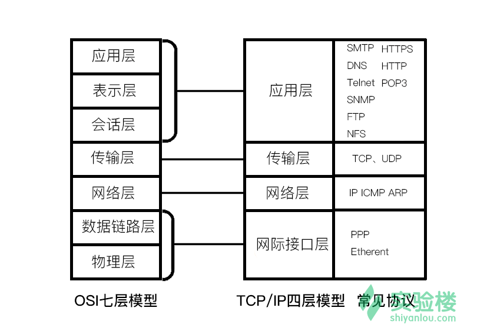
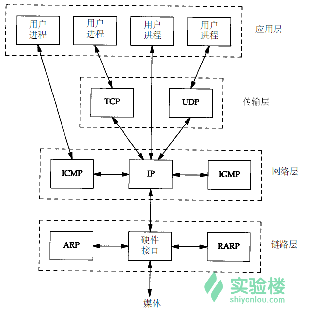
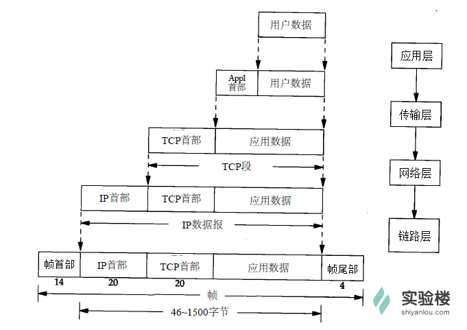
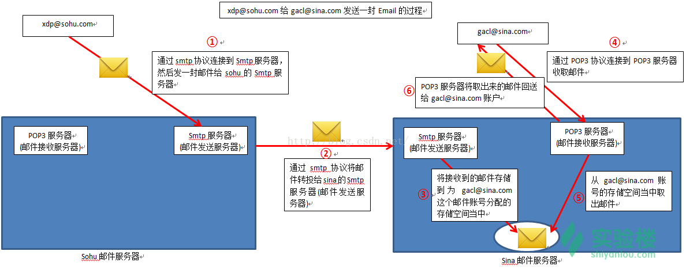

```
ipconfig -a     查看IP地址
ping www.github.com    ping 程序是对两台主机之间连通性进行测试的基本工具，它只是利用 ICMP 回显请求和回显应答报文，而不用经过传输层（TCP/UDP）
traceroute github.com  ping 程序和 traceroute 程序是两个常见的 基于 ICMP 协议 的工具。
netstat -in     查看MTU
route -n        查看路由表
arp -a          查看ARP缓存表
        抓取UDP报文
        
host mirrors.aliyuncs.com   查询DNS
telnet 127.0.0.1 端口 测试本地环境端口开放性

netstat 显示网络相关信息
netstat -pantu  实验楼中提供的，查看本地端口开放性
netstat -ap tcp 验证后的mac下面查看本地端口开放性的方法
```


# TCP/IP 简介
上世纪 70 年代，随着计算机技术的发展，计算机使用者意识到：要想发挥计算机更大的作用，就要将世界各地的计算机连接起来。但是简单的连接是远远不够的，因为计算机之间无法沟通。因此设计一种通用的“语言”来交流是必不可少的，这时 TCP/IP 协议就应运而生了。

TCP/IP（Transmission Control Protocol/Internet Protocol）是传输控制协议和网络协议的简称，它定义了电子设备如何连入因特网，以及数据如何在它们之间传输的标准。

TCP/IP 不是一个协议，而是一个协议族的统称，里面包括了 IP 协议、ICMP 协议、TCP 协议、以及 http、ftp、pop3 协议等。网络中的计算机都采用这套协议族进行互联。

网络协议栈架构
-

提到网络协议栈结构，最著名的当属 OSI 七层模型，但是 TCP/IP 协议族的结构则稍有不同，它们之间的层次结构有如图对应关系：

可见 TCP/IP 被分为 4 层，每层承担的任务不一样，各层的协议的工作方式也不一样，每层封装上层数据的方式也不一样：

(1)应用层：应用程序通过这一层访问网络，常见 FTP、HTTP、DNS 和 TELNET 协议；

(2)传输层：TCP 协议和 UDP 协议；

(3)网络层：IP 协议，ARP、RARP 协议，ICMP 协议等；

(4)网络接口层：是 TCP/IP 协议的基层，负责数据帧的发送和接收。



封装和分用
-
封装：当应用程序发送数据的时候，数据在协议层次当中从顶向下通过每一层，每一层都会对数据增加一些首部或尾部信息，这样的信息称之为协议数据单元（Protocol Data Unit，缩写为PDU），在分层协议系统里，在指定的协议层上传送的数据单元，包含了该层的协议控制信息和用户信息。如下图所示：

物理层（一层）PDU指数据位（Bit）

数据链路层（二层）PDU指数据帧（Frame）

网络层（三层）PDU指数据包（Packet）

传输层（四层）PDU指数据段（Segment）

第五层以上为数据（data）

分用：当主机收到一个数据帧时，数据就从协议层底向上升，通过每一层时，检查并去掉对应层次的报文首部或尾部，与封装过程正好相反。




#传输层：UDP协议

tcpdump 抓取 UDP 报文
-

来自实验楼的课程，[TCP/IP网络协议基础](https://www.shiyanlou.com/courses/98/labs/541/document)

现在我们动手实践，尝试抓取一个 UDP 数据报，并解读其内容。

我们需要一个小程序，用于向 指定 IP 地址 的 指定端口 发送一个 指定内容 的 UDP 数据报，这个程序已经编写好，依次输入以下命令，使用 github 把它下载下来，并编译 (需要在文件头添加 `#include <arpa/inet.h>`)：

```
cd Desktop

git clone https://github.com/shiyanlou/tcp_ip_5

cd tcp_ip_5

gcc -o test test.c
```

这个 C 程序会向 IP 地址 192.168.1.1 的 7777 端口 发送一条 "hello" 消息。你可以用编辑器修改程序，向不同的 IP 不同的 IP 发送不同的内容。

编译完成后先别运行，我们还需要使用一个知名的抓包工具 tcpdump ，依次输入以下命令安装，并运行 tcpdump：

```
sudo apt-get update
sudo apt-get install tcpdump
sudo tcpdump -vvv -X udp port 7777
```

现在最小化当前终端，另开启一个终端，输入以下命令运行刚才编译好的 C 程序 test：

```
cd Desktop/tcp_ip_5

./test
```

test 程序运行结束，返回刚才运行 tcpdump 的终端查看抓包结果：


##tcpdump 抓取 UDP 报文

来自实验楼的课程，[TCP/IP网络协议基础](https://www.shiyanlou.com/courses/98/labs/556/document)

上一节实验，我们用 tcpdump 抓取并阅读了 UDP 报文，那么这次我们尝试抓取 TCP 报文段。当然首先要安装 tcpdump(安装方法参考上一节实验)。

针对这次实验，需要下载从 github 下载代码，是基于 TCP 的聊天小程序，分为 server(服务端)和 client(客户端)：
```
cd Desktop

git clone https://github.com/shiyanlou/tcp_ip_6

cd tcp_ip_6

gcc -o server server.c

gcc -o client client.c
```

编译完成后先不要运行，先打开 tcpdump，使用命令安装并运行 tcpdump：

```
sudo apt-get update
sudo apt-get install tcpdump
sudo tcpdump -vvv -X -i lo tcp port 7777
```
最小化运行 tcpdump 的终端，然后另开一个终端，运行 server 程序：

```
cd Desktop/tcp_ip_6

./server 127.0.0.1
```
然后再打开第三个终端，运行 client 程序：

```
cd Desktop/tcp_ip_6

./client 127.0.0.1
```
现在，使用 client 和 server 聊天，轮流互发几条简短的消息(比如 hello、hi、wei 之类的)便可以关闭 client 和 server，回到运行 tcpdump 的终端查看抓取的报文段内容：


#应用层协议一

在传输层之上，便是应用层。传输层的 UDP 报文和 TCP 报文段的数据部分就是应用层交付的数据。

不同类型的网络应用有不同的通信规则，因此应用层协议是多种多样的，比如 DNS、FTP、Telnet、SMTP、HTTP、RIP、NFS 等协议都是用于解决其各自的一类问题。

本节实验，介绍 DNS、FTP、HTTP 三个常用的应用层协议。

DNS 协议
-
DNS (Domain Name Service 域名服务) 协议基于 UDP，使用端口号 53。

由数字组成的 IP 地址很难记忆，所以我们上网使用网站 IP 地址的别名——域名。实际使用中，域名与 IP 地址是对应的，这种对应关系保存在DNS 服务器之中。

在浏览器中输入一个域名后，会有 DNS 服务器将域名解析为对应的 IP 地址。注意这和网络层的 ARP 协议的不同之处：DNS 提供的是域名与 IP 地址的对应关系，而 ARP 提供的是 IP 地址和 MAC 地址的对应关系。

...

在实际上网过程中，域名解析的的优先顺序是：先在 DNS 缓存查询，若没有找到记录，再查询 hosts 文件，若还是没找到记录，再向 DNS 服务器发出 DNS 查询报文。

FTP 协议
-
FTP (File Transfer Protocol 文件传输协议) 基于 TCP，使用端口号 20(数据)和 21(控制)。

它的主要功能是减少或消除在不同操作系统下处理文件的不兼容性，以达到便捷高效的文件传输效果。

FTP 只提供文件传输的基本服务，它采用 客户端—服务器 的方式，一个 FTP 服务器可同时为多个客户端提供服务。

在进行文件传输时，FTP 的客户端和服务器之间会建立两个 TCP 连接：21 号端口建立控制连接，20 号端口建立数据连接。

FTP 的传输有两种方式：ASCII 传输模式和二进制数据传输模式。

HTTP 协议
-
HTTP (HyperText Transfer Protocol 超文本传输协议) 基于 TCP，使用端口号 80 或 8080。

每当你在浏览器里输入一个网址或点击一个链接时，浏览器就通过 HTTP 协议将网页信息从服务器提取再显示出来，这是现在使用频率最大的应用层协议。这个原理很简单：

点击一个链接后，浏览器向服务器发起 TCP 连接；

连接建立后浏览器发送 HTTP 请求报文，然后服务器回复响应报文；

浏览器将收到的响应报文内容显示在网页上；

报文收发结束，关闭 TCP 连接。

```
1、使用 host 命令查看常见网站的 IP 地址，用 tcpdump 抓取 DNS 报文做解读，并截图。

参考：tcpdump 抓取命令：
	sudo tcpdump -vvv -X udp port 53

```

# 应用层协议二
Telnet 简介
-
Telnet 协议是 TCP/IP 协议族中的一员，是 Internet 远程登陆服务的标准协议和主要方式，它基于 TCP 协议，使用端口 23。

终端使用者在本地电脑上使用 telnet 程序，用它连接到服务器，终端使用者可以在 telnet 程序中输入命令，这些命令会在服务器上运行，就像直接在服务器的控制台上输入一样。

`telnet 使用语法：telnet IP 端口（可选）`

telnet 127.0.0.1 端口 测试本地环境端口开放性

TFTP 协议
-
TFTP（ Trivial File Transfer Protocol ）是 TCP/IP 协议族中的一个用来在客户机与服务器之间进行简单文件传输的协议，提供不复杂、开销不大的文件传输服务，它基于 UDP 协议，使用端口 69 。

此协议设计的时候是进行小文件传输的，与 FTP 相比少了许多功能，它只能从文件服务器上获得或写入文件，不能列出目录，不进行认证。

TFTP也有着它自身的优点：

TFTP 可用于 UDP 环境；比如当需要将程序或者文件同时向许多机器下载时就往往需要使用到 TFTP 协议。

TFTP 代码所占的内存较小，这对于小型计算机或者某些特殊用途的设备来说是很重要的，TFTP 具有更多的灵活性，也减少了开销。

SMTP 协议和 POP3 协议
-
SMTP（Simple Mail Transfer Protocol）即简单邮件传输协议，它是一组用于由源地址到目的地址传送邮件的规则，由它来控制信件的中转方式,它使用 TCP 协议，使用端口 25 。

SMTP 存在两个端：
在发信人的邮件服务器上执行的客户端
在收信人的邮件服务器上执行的服务器端。
SMTP 的客户端和服务器端同时运行在每个邮件服务器上。当一个邮件服务器在向其他邮件服务器发送邮件消息时，它是作为SMTP客户在运行。

POP3（Post Office Protocol Version 3 ）即邮局协议版本3，是 TCP/IP 协议族中的一员 ，主要用于支持使用客户端远程管理在服务器上的电子邮件，使用 TCP 协议，使用端口 110 。

POP3 邮件服务器大都可以“只下载邮件，服务器端并不删除”，也就是改进的 POP3 协议。

POP3 和 SMTP 协同工作, 一封邮件的发送过程：



```
使用 telnet 命令测试本地端口开放情况，并用 netstat -pantu 命令验证。
mac下面命令使用不成功，google之后发现相似命令完成同样功能，netstat -ap tcp）
```